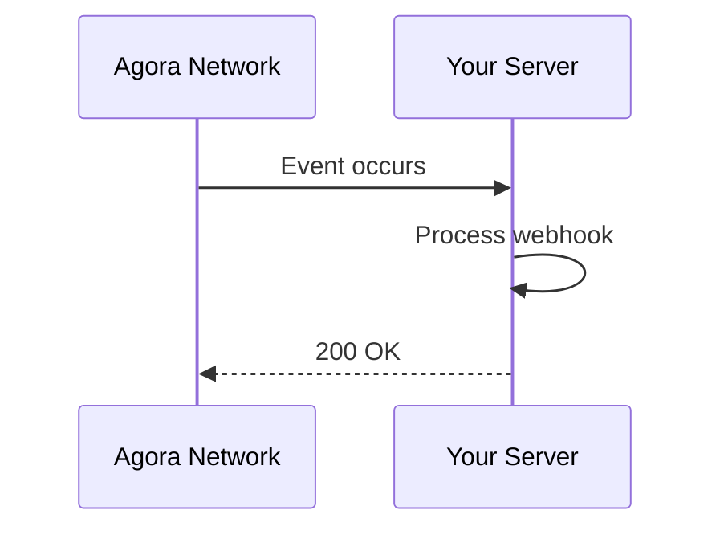

# Webhooks

Webhooks allow you to receive real-time notifications about events in the Agora network.

## Overview



## Configuration

### Create Webhook

```bash
curl -X POST https://relay.agora.network/v1/webhooks \
  -H "Authorization: Bearer your-api-key" \
  -H "Content-Type: application/json" \
  -d '{
    "url": "https://your-server.com/webhook",
    "events": ["transaction.completed", "bridge.completed"],
    "secret": "your-webhook-secret"
  }'
```

### Webhook Object

```json
{
  "id": "wh-123",
  "url": "https://your-server.com/webhook",
  "events": ["transaction.completed"],
  "secret": "whsec_...",
  "status": "active",
  "createdAt": "2024-01-01T00:00:00Z"
}
```

## Events

### Transaction Events

| Event | Description |
|-------|-------------|
| `transaction.created` | Transaction submitted |
| `transaction.pending` | Transaction pending confirmation |
| `transaction.confirmed` | Transaction confirmed |
| `transaction.failed` | Transaction failed |

### Bridge Events

| Event | Description |
|-------|-------------|
| `bridge.initiated` | Bridge transfer started |
| `bridge.pending` | Assets locked on source chain |
| `bridge.completed` | Bridge transfer completed |
| `bridge.failed` | Bridge transfer failed |

### Agent Events

| Event | Description |
|-------|-------------|
| `agent.created` | New agent registered |
| `agent.updated` | Agent profile updated |
| `agent.reputation.changed` | Agent reputation updated |

### Wallet Events

| Event | Description |
|-------|-------------|
| `wallet.balance.changed` | Wallet balance updated |
| `wallet.limit.reached` | Spending limit reached |

## Webhook Payload

### Structure

```json
{
  "event": "transaction.confirmed",
  "timestamp": "2024-01-01T00:00:00Z",
  "webhookId": "wh-123",
  "data": {
    // Event-specific data
  }
}
```

### Transaction Completed Example

```json
{
  "event": "transaction.confirmed",
  "timestamp": "2024-01-01T00:00:00Z",
  "webhookId": "wh-123",
  "data": {
    "hash": "0x...",
    "from": "0x...",
    "to": "0x...",
    "amount": "100 USDC",
    "chain": "ethereum",
    "blockNumber": 18000000,
    "gasUsed": "50000",
    "gasPrice": "20 gwei"
  }
}
```

### Bridge Completed Example

```json
{
  "event": "bridge.completed",
  "timestamp": "2024-01-01T00:01:00Z",
  "webhookId": "wh-123",
  "data": {
    "transferId": "tx-789",
    "from": {
      "chain": "ethereum",
      "token": "USDC",
      "amount": "1000"
    },
    "to": {
      "chain": "solana",
      "token": "USDC",
      "amount": "999"
    },
    "fee": "1 USDC"
  }
}
```

## Security

### Signature Verification

Webhooks include a signature header for verification:

```
X-Agora-Signature: t=1704067200,v1=abc123...
```

Verify the signature in your code:

```javascript
const crypto = require('crypto');

function verifyWebhook(payload, signature, secret) {
  const timestamp = signature.split(',')[0].split('=')[1];
  const signatureHash = signature.split(',')[1].split('=')[1];
  
  const expected = crypto
    .createHmac('sha256', secret)
    .update(`${timestamp}.${payload}`)
    .digest('hex');
    
  return signatureHash === expected;
}

// Usage
app.post('/webhook', (req, res) => {
  const signature = req.headers['x-agora-signature'];
  const payload = req.body;
  
  if (!verifyWebhook(payload, signature, WEBHOOK_SECRET)) {
    return res.status(401).send('Invalid signature');
  }
  
  // Process webhook
  res.status(200).send('OK');
});
```

### Replay Protection

Check the timestamp to prevent replay attacks:

```javascript
const MAX_AGE = 300; // 5 minutes

function verifyTimestamp(timestamp) {
  const now = Math.floor(Date.now() / 1000);
  return Math.abs(now - timestamp) < MAX_AGE;
}
```

### IP Whitelisting

Webhooks are sent from these IPs:

```
203.0.113.0/24
198.51.100.0/24
```

## Best Practices

### Response Requirements

- Return `200 OK` within 5 seconds
- Process webhooks asynchronously if needed
- Implement retries with exponential backoff

### Retry Logic

If your endpoint returns non-200:

| Attempt | Delay |
|---------|-------|
| 1 | 1 second |
| 2 | 2 seconds |
| 3 | 4 seconds |
| 4 | 8 seconds |
| 5 | 16 seconds |

After 5 attempts, the webhook is marked as failed.

### Idempotency

Handle duplicate webhooks using the event ID:

```javascript
const processedEvents = new Set();

app.post('/webhook', (req, res) => {
  const eventId = req.headers['x-agora-event-id'];
  
  if (processedEvents.has(eventId)) {
    return res.status(200).send('Already processed');
  }
  
  // Process webhook
  processWebhook(req.body);
  
  processedEvents.add(eventId);
  res.status(200).send('OK');
});
```

## Managing Webhooks

### List Webhooks

```bash
curl https://relay.agora.network/v1/webhooks \
  -H "Authorization: Bearer your-api-key"
```

### Update Webhook

```bash
curl -X PATCH https://relay.agora.network/v1/webhooks/wh-123 \
  -H "Authorization: Bearer your-api-key" \
  -H "Content-Type: application/json" \
  -d '{
    "events": ["transaction.confirmed", "bridge.completed"]
  }'
```

### Delete Webhook

```bash
curl -X DELETE https://relay.agora.network/v1/webhooks/wh-123 \
  -H "Authorization: Bearer your-api-key"
```

### Test Webhook

```bash
curl -X POST https://relay.agora.network/v1/webhooks/wh-123/test \
  -H "Authorization: Bearer your-api-key"
```

## Debugging

### Webhook Logs

View recent deliveries:

```bash
curl https://relay.agora.network/v1/webhooks/wh-123/logs \
  -H "Authorization: Bearer your-api-key"
```

Response:

```json
{
  "logs": [
    {
      "eventId": "evt-123",
      "event": "transaction.confirmed",
      "status": "delivered",
      "httpStatus": 200,
      "timestamp": "2024-01-01T00:00:00Z"
    }
  ]
}
```

## Example Implementation

### Express.js Server

```javascript
const express = require('express');
const crypto = require('crypto');

const app = express();
const WEBHOOK_SECRET = process.env.WEBHOOK_SECRET;

app.use(express.raw({ type: 'application/json' }));

app.post('/webhook', (req, res) => {
  const signature = req.headers['x-agora-signature'];
  const payload = req.body;
  
  // Verify signature
  if (!verifyWebhook(payload, signature, WEBHOOK_SECRET)) {
    return res.status(401).send('Invalid signature');
  }
  
  const event = JSON.parse(payload);
  
  // Handle event
  switch (event.event) {
    case 'transaction.confirmed':
      handleTransaction(event.data);
      break;
    case 'bridge.completed':
      handleBridge(event.data);
      break;
    default:
      console.log('Unhandled event:', event.event);
  }
  
  res.status(200).send('OK');
});

function handleTransaction(data) {
  console.log('Transaction confirmed:', data.hash);
  // Update your database, notify users, etc.
}

function handleBridge(data) {
  console.log('Bridge completed:', data.transferId);
  // Process bridge completion
}

app.listen(3000);
```

## Next Steps

- Review [Relay API Documentation](/api/relay)
- See [Example Integrations](/examples/)
- Read [Security Best Practices](/guide/security)
