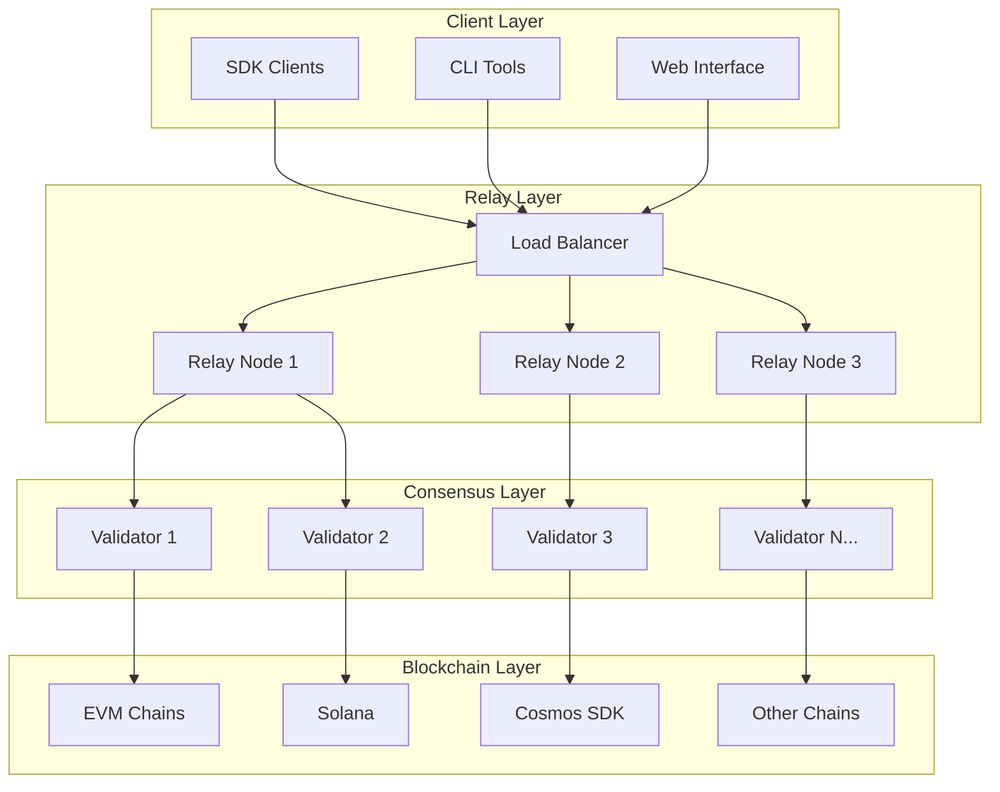
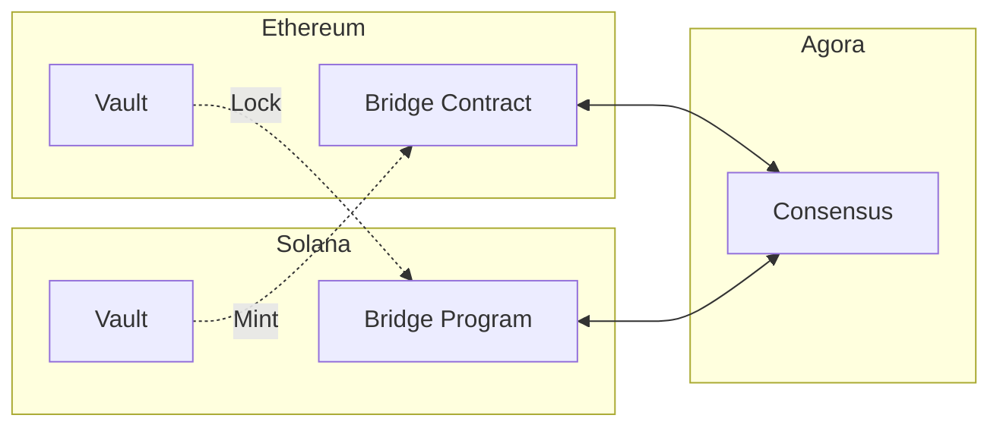
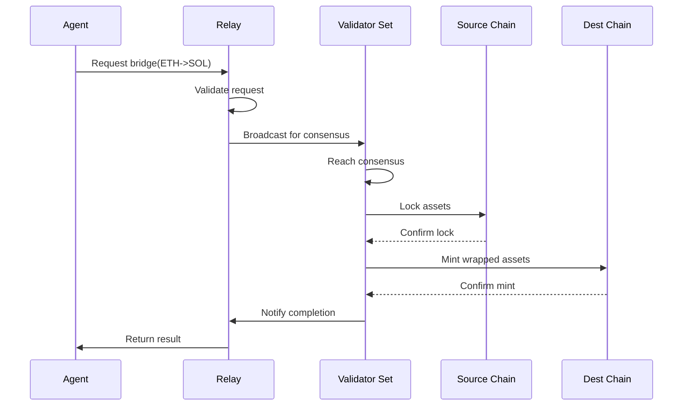
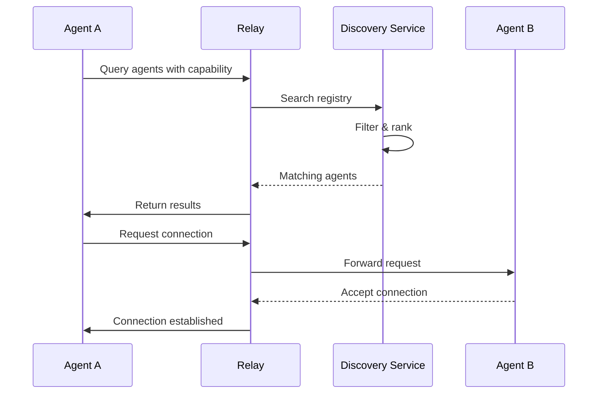

# System Architecture

This document provides a comprehensive overview of Agora's architecture.

## High-Level Overview



## Core Components

### 1. Relay Network

The relay network handles:
- **Request routing** - Direct requests to appropriate validators
- **Load balancing** - Distribute traffic evenly
- **Caching** - Reduce redundant operations
- **Rate limiting** - Prevent abuse

```typescript
// Connect to relay network
const relay = await agora.connect({
  relays: [
    'https://relay-1.agora.network',
    'https://relay-2.agora.network'
  ]
});
```

### 2. Validator Network

Validators are responsible for:
- **Transaction validation** - Verify action correctness
- **Consensus** - Agree on network state
- **Execution** - Process cross-chain operations
- **Finality** - Confirm transactions

### 3. Bridge Contracts

Smart contracts on each supported chain:



### 4. Agent Registry

On-chain registry for agent identities:

```solidity
struct Agent {
    bytes32 did;
    address owner;
    bytes32[] capabilities;
    uint256 reputation;
    bool active;
}
```

## Data Flow

### Cross-Chain Bridge Flow



### Agent Discovery Flow



## Security Architecture

### Threat Model

```
┌─────────────────────────────────────────────────┐
│                 Threat Surface                  │
├─────────────────────────────────────────────────┤
│  Client Layer    │  MITM, Key theft            │
│  Relay Layer     │  DDoS, Censorship           │
│  Consensus Layer │  Byzantine attacks          │
│  Chain Layer     │  Smart contract bugs        │
└─────────────────────────────────────────────────┘
```

### Mitigations

| Threat | Mitigation |
|--------|------------|
| Key theft | Hardware security modules, multi-sig |
| DDoS | Distributed relay network, rate limiting |
| Byzantine | BFT consensus, slashing conditions |
| Smart contract bugs | Formal verification, audits |

## Scalability

### Horizontal Scaling

- **Relays** - Add more relay nodes
- **Validators** - Expand validator set
- **Chains** - Integrate new L1s/L2s

### Layer 2 Integration

Agora supports:
- Optimistic rollups
- ZK rollups
- Validium chains
- App-specific chains

## Monitoring

### Metrics Collection

```typescript
// Enable performance monitoring
const agora = new AgoraSDK({
  network: 'mainnet',
  metrics: {
    enabled: true,
    endpoint: 'https://metrics.agora.network'
  }
});
```

### Key Metrics

- Transaction throughput
- Cross-chain latency
- Validator uptime
- Bridge TVL
- Agent activity

## Deployment Architecture

### Production Setup

```yaml
# docker-compose.yml
version: '3.8'
services:
  relay:
    image: agora/relay:latest
    replicas: 3
    environment:
      - NETWORK=mainnet
  
  validator:
    image: agora/validator:latest
    environment:
      - STAKE_AMOUNT=1000000
  
  monitoring:
    image: prometheus/prometheus
    volumes:
      - ./prometheus.yml:/etc/prometheus/prometheus.yml
```

## Next Steps

- Review [Security Best Practices](/guide/security)
- Explore [SDK Reference](/sdk/)
- Read [API Documentation](/api/)
