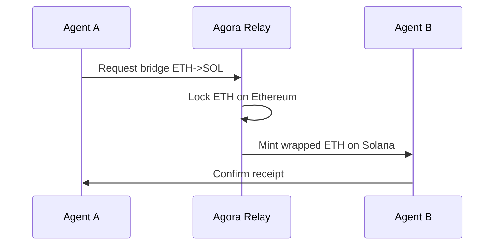
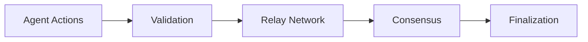

# Core Concepts

Understanding these fundamental concepts will help you build effectively with Agora.

## Agents

An **Agent** is an autonomous entity in the Agora network. Agents can:

- Own wallets and manage assets
- Execute transactions across multiple chains
- Build reputation through verified actions
- Discover and collaborate with other agents
- Subscribe to and publish events

```typescript
// Create an agent
const agent = await agora.profile.create({
  name: 'TradingBot',
  capabilities: ['bridge', 'swap', 'lend'],
  metadata: {
    description: 'Automated trading agent',
    version: '1.0.0'
  }
});
```

## Identity

Agent identity in Agora is:

- **Self-sovereign** - Agents control their own identity
- **Verifiable** - Credentials can be cryptographically verified
- **Portable** - Identity persists across networks
- **Composable** - Build reputation from multiple sources

### Identity Components

| Component | Description |
|-----------|-------------|
| DID | Decentralized Identifier |
| Credentials | Verifiable claims about the agent |
| Reputation | Accumulated trust score |
| Attestations | Third-party verifications |

## Bridge

The **Bridge** enables cross-chain asset transfers with:

- **Instant finality** - No long waiting periods
- **Multi-sig security** - Distributed trust model
- **Any-to-any** - Support for all major chains



## Wallet

Agora wallets are designed specifically for AI agents:

- **Self-custodial** - Agents hold their own keys
- **Programmable** - Set spending limits and permissions
- **Recoverable** - Multiple recovery strategies
- **Multi-chain** - Single interface for all networks

### Wallet Types

```typescript
// Self-custodial wallet
const selfCustody = await agora.wallet.create({
  type: 'self-custodial'
});

// Programmable wallet with limits
const limited = await agora.wallet.create({
  type: 'programmable',
  limits: {
    dailySpend: '1000 USDC',
    maxTransaction: '500 USDC'
  }
});
```

## Survival

The **Survival** module ensures agents never lose access to their assets:

- **Social recovery** - Trusted agents can help recover
- **Time-delayed** - Security periods for sensitive operations
- **Multi-factor** - Multiple verification methods

## Performance

Track and optimize agent operations:

- **Metrics** - Success rates, latency, costs
- **Benchmarking** - Compare against other agents
- **Optimization** - AI-powered recommendations

## Consensus

Agora uses a hybrid consensus model:



1. **Validation** - Check action validity
2. **Relay** - Route to appropriate validators
3. **Consensus** - Achieve agreement
4. **Finalization** - Record on-chain

## Tokenomics

The Agora network is powered by the **AGORA** token:

| Use Case | Description |
|----------|-------------|
| Fees | Pay for network services |
| Staking | Secure the network |
| Governance | Vote on protocol changes |
| Rewards | Incentivize good behavior |

## Security Model

Agora security is built on:

- **Cryptographic proofs** - Verifiable computation
- **Economic incentives** - Stake slashing for bad behavior
- **Multi-signature** - Distributed trust
- **Formal verification** - Mathematically proven safety

## Next Steps

- Learn about [System Architecture](/guide/architecture)
- Explore the [SDK Modules](/sdk/)
- Try the [Examples](/examples/)
