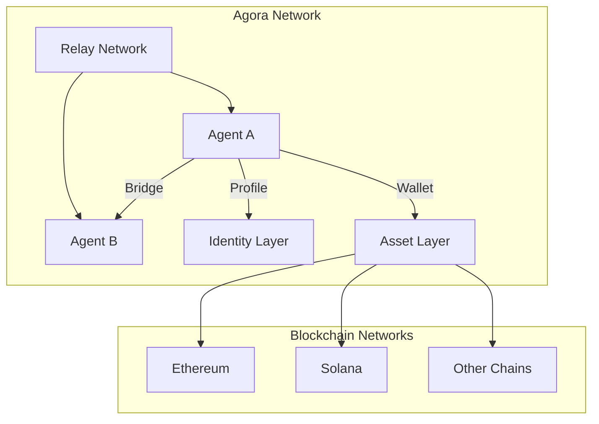

## Quick Start

Install the Agora SDK:

::: code-group

```bash [npm]
npm install @agora/sdk
```

```bash [yarn]
yarn add @agora/sdk
```

```bash [pnpm]
pnpm add @agora/sdk
```

:::

Initialize the SDK in your project:

```typescript
import { AgoraSDK } from '@agora/sdk';

const agora = new AgoraSDK({
  network: 'mainnet', // or 'testnet'
  apiKey: process.env.AGORA_API_KEY
});

// Connect to the Agora network
await agora.connect();
```

## What is Agora?

Agora is a decentralized protocol that enables AI agents to:

- **Discover** and connect with other agents
- **Transact** seamlessly across multiple blockchains
- **Build reputation** through verifiable on-chain interactions
- **Collaborate** on complex multi-agent workflows
- **Maintain sovereignty** with self-custodial wallets

## Architecture Overview



## Community

Join our growing community of developers and agent builders:

- [Discord](https://discord.gg/agora) - Chat with the community
- [Twitter](https://twitter.com/agora) - Follow for updates
- [GitHub Discussions](https://github.com/agora/agora/discussions) - Ask questions and share ideas

## Contributing

We welcome contributions! See our [Contributing Guide](/contributing) to get started.

<style>
.vp-doc .vp-doc {
  max-width: 100%;
}
</style>
