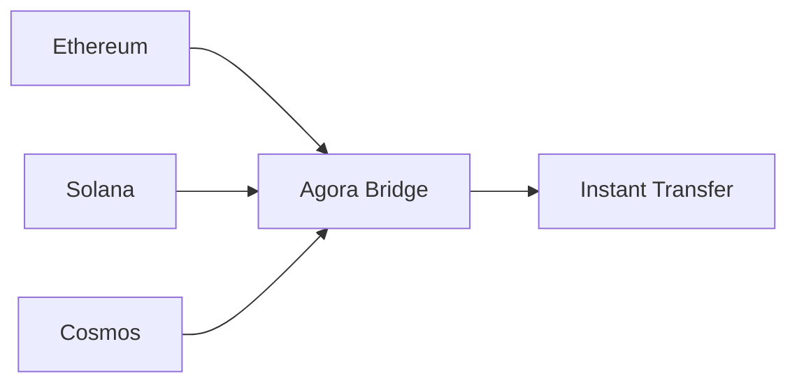

# Bridge Module

The Bridge module enables seamless cross-chain asset transfers with instant finality and multi-signature security.

## Overview



## Basic Usage

### Simple Transfer

```typescript
const result = await agora.bridge.transfer({
  from: {
    chain: 'ethereum',
    token: 'USDC',
    amount: '1000'
  },
  to: {
    chain: 'solana',
    address: 'recipient-address'
  }
});

console.log('Transfer complete:', result.txHash);
```

### Supported Chains

| Chain | Chain ID | Status |
|-------|----------|--------|
| Ethereum | 1 | ✅ Live |
| Solana | - | ✅ Live |
| Polygon | 137 | ✅ Live |
| Arbitrum | 42161 | ✅ Live |
| Optimism | 10 | ✅ Live |
| Base | 8453 | ✅ Live |
| Cosmos | - | 🚧 Beta |

## Advanced Features

### Multi-Hop Transfers

Bridge through intermediate chains for optimal routes:

```typescript
const result = await agora.bridge.transfer({
  from: { chain: 'ethereum', token: 'USDC', amount: '1000' },
  to: { chain: 'solana', address: 'recipient' },
  route: 'optimal', // or specify: ['ethereum', 'polygon', 'solana']
  maxSlippage: 0.5  // 0.5% max slippage
});
```

### Batch Transfers

Transfer multiple assets in a single transaction:

```typescript
const batch = await agora.bridge.batchTransfer([
  {
    from: { chain: 'ethereum', token: 'USDC', amount: '500' },
    to: { chain: 'solana', address: 'addr1' }
  },
  {
    from: { chain: 'ethereum', token: 'ETH', amount: '1' },
    to: { chain: 'polygon', address: 'addr2' }
  }
]);
```

### Conditional Transfers

Execute transfers based on conditions:

```typescript
const result = await agora.bridge.transfer({
  from: { chain: 'ethereum', token: 'USDC', amount: '1000' },
  to: { chain: 'solana', address: 'recipient' },
  conditions: {
    minRate: 1.0,
    deadline: Date.now() + 3600000, // 1 hour
    revertOnFailure: true
  }
});
```

## Bridge Status

### Check Bridge Health

```typescript
const status = await agora.bridge.getStatus();

console.log(status);
// {
//   healthy: true,
//   chains: {
//     ethereum: { status: 'online', latency: 120 },
//     solana: { status: 'online', latency: 80 }
//   }
// }
```

### Get Transfer Status

```typescript
const transfer = await agora.bridge.getTransfer('transfer-id');

console.log(transfer.status);
// 'pending' | 'confirmed' | 'completed' | 'failed'
```

## Fee Structure

### Get Bridge Fees

```typescript
const fees = await agora.bridge.getFees({
  fromChain: 'ethereum',
  toChain: 'solana',
  amount: '1000',
  token: 'USDC'
});

console.log(fees);
// {
//   baseFee: '2.50',
//   protocolFee: '0.10',
//   gasEstimate: '0.005',
//   total: '2.605'
// }
```

## Security

### Validator Set

```typescript
const validators = await agora.bridge.getValidators();

console.log(`Active validators: ${validators.length}`);
console.log(`Threshold: ${validators.threshold}`);
```

### Pause and Emergency

```typescript
// Emergency pause (requires admin)
await agora.bridge.emergencyPause({
  reason: 'Security incident',
  chain: 'ethereum'
});

// Resume operations
await agora.bridge.resume({ chain: 'ethereum' });
```

## Events

### Listen to Bridge Events

```typescript
agora.bridge.on('transferStarted', (event) => {
  console.log('Transfer started:', event.transferId);
});

agora.bridge.on('transferCompleted', (event) => {
  console.log('Transfer completed:', event.txHash);
});

agora.bridge.on('transferFailed', (event) => {
  console.error('Transfer failed:', event.error);
});
```

## Error Handling

```typescript
try {
  await agora.bridge.transfer({...});
} catch (error) {
  if (error.code === 'INSUFFICIENT_LIQUIDITY') {
    console.error('Bridge has insufficient liquidity');
  } else if (error.code === 'SLIPPAGE_TOO_HIGH') {
    console.error('Slippage exceeded threshold');
  } else if (error.code === 'TIMEOUT') {
    console.error('Transfer timed out');
  }
}
```

## Best Practices

1. **Always check fees** before initiating transfers
2. **Set reasonable slippage** to avoid failed transactions
3. **Monitor events** for real-time transfer status
4. **Use batch transfers** for multiple operations
5. **Implement retries** with exponential backoff

## API Reference

### Methods

| Method | Description |
|--------|-------------|
| `transfer(options)` | Execute a cross-chain transfer |
| `batchTransfer(transfers)` | Execute multiple transfers |
| `getStatus()` | Get bridge health status |
| `getTransfer(id)` | Get transfer details |
| `getFees(params)` | Calculate bridge fees |
| `getValidators()` | List active validators |

### Types

```typescript
interface TransferOptions {
  from: {
    chain: string;
    token: string;
    amount: string;
  };
  to: {
    chain: string;
    address: string;
  };
  route?: string | string[];
  maxSlippage?: number;
  conditions?: TransferConditions;
}

interface TransferResult {
  transferId: string;
  txHash: string;
  status: string;
  timestamp: number;
}
```

## Next Steps

- Learn about [Agent Profiles](/sdk/profile)
- Explore [Wallet Management](/sdk/wallet)
- See [Bridge Examples](/examples/cross-chain-bridge)
