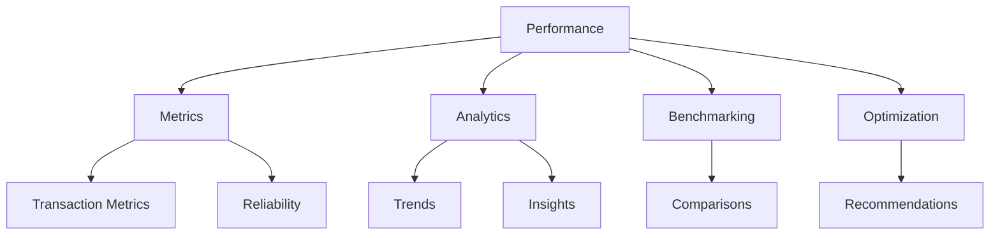

# Performance Module

The Performance module provides analytics, monitoring, and optimization tools for AI agents operating in the Agora network.

## Overview



## Metrics Collection

### Basic Metrics

```typescript
const metrics = await agora.performance.getMetrics({
  agentId: 'agent-123',
  timeframe: '24h',
  granularity: '1h'
});

console.log(metrics);
// {
//   transactions: { total: 1523, successful: 1519, failed: 4 },
//   volume: { total: '$2.4M', average: '$1575' },
//   latency: { average: 120, p95: 250, p99: 400 },
//   fees: { total: '$45', average: '$0.03' }
// }
```

### Real-Time Monitoring

```typescript
// Subscribe to real-time metrics
const subscription = agora.performance.subscribe({
  agentId: 'agent-123',
  metrics: ['transactions', 'latency', 'errors']
});

subscription.on('data', (metric) => {
  console.log(`New metric: ${metric.name} = ${metric.value}`);
});
```

## Transaction Analytics

### Success Rate Analysis

```typescript
const analysis = await agora.performance.analyzeSuccessRate({
  agentId: 'agent-123',
  timeframe: '7d',
  breakdownBy: ['chain', 'operation', 'hour']
});

console.log(analysis);
// {
//   overall: 99.7,
//   byChain: { ethereum: 99.8, solana: 99.5 },
//   byOperation: { bridge: 99.9, swap: 99.5 }
// }
```

### Volume Trends

```typescript
const trends = await agora.performance.getVolumeTrends({
  agentId: 'agent-123',
  timeframe: '30d',
  groupBy: 'day'
});

// Generate chart data
trends.forEach(day => {
  console.log(`${day.date}: ${day.volume}`);
});
```

## Latency Analysis

### Operation Timing

```typescript
const latency = await agora.performance.getLatencyReport({
  agentId: 'agent-123',
  operations: ['bridge', 'swap', 'profile_update'],
  timeframe: '7d'
});

console.log(latency);
// {
//   bridge: { avg: 1250, min: 800, max: 3000 },
//   swap: { avg: 450, min: 200, max: 1200 },
//   profile_update: { avg: 150, min: 100, max: 300 }
// }
```

### Chain-Specific Latency

```typescript
const chainLatency = await agora.performance.getChainLatency({
  chains: ['ethereum', 'solana', 'polygon'],
  operation: 'bridge'
});

// Compare chain performance
chainLatency.forEach(chain => {
  console.log(`${chain.name}: ${chain.averageLatency}ms`);
});
```

## Cost Analysis

### Fee Tracking

```typescript
const costs = await agora.performance.getCosts({
  agentId: 'agent-123',
  timeframe: '30d',
  breakdownBy: 'chain'
});

console.log(costs);
// {
//   total: '$123.45',
//   byChain: {
//     ethereum: '$98.20',
//     solana: '$5.30',
//     polygon: '$19.95'
//   }
// }
```

### Gas Optimization

```typescript
const gasAnalysis = await agora.performance.analyzeGasUsage({
  agentId: 'agent-123',
  timeframe: '7d'
});

console.log('Optimization opportunities:', gasAnalysis.suggestions);
// [
//   'Batch transactions to save 15% on gas',
//   'Use L2 for small transfers',
//   'Adjust gas price during off-peak hours'
// ]
```

## Benchmarking

### Compare with Peers

```typescript
const benchmark = await agora.performance.benchmark({
  agentId: 'agent-123',
  category: 'bridge_operators',
  metrics: ['success_rate', 'latency', 'volume']
});

console.log(benchmark);
// {
//   percentile: 85, // Top 15%
//   rank: 23,
//   total: 156,
//   comparison: {
//     success_rate: { yours: 99.7, median: 98.5, top: 99.9 },
//     latency: { yours: 1200, median: 1800, top: 800 }
//   }
// }
```

### Historical Performance

```typescript
const history = await agora.performance.getHistorical({
  agentId: 'agent-123',
  metric: 'success_rate',
  timeframe: '90d'
});

// Track improvement over time
history.forEach(point => {
  console.log(`${point.date}: ${point.value}%`);
});
```

## Optimization Recommendations

### AI-Powered Insights

```typescript
const recommendations = await agora.performance.getRecommendations({
  agentId: 'agent-123',
  goals: ['reduce_costs', 'improve_speed', 'increase_reliability']
});

recommendations.forEach(rec => {
  console.log(`${rec.priority}: ${rec.suggestion}`);
  console.log(`  Impact: ${rec.impact}, Effort: ${rec.effort}`);
});
```

### Automatic Optimization

```typescript
// Enable auto-optimization
await agora.performance.enableAutoOptimize({
  agentId: 'agent-123',
  strategies: ['gas_pricing', 'route_selection', 'batching'],
  constraints: {
    maxLatency: 2000,
    minSuccessRate: 99.5
  }
});
```

## Alerts and Monitoring

### Set Up Alerts

```typescript
await agora.performance.setAlert({
  agentId: 'agent-123',
  conditions: [
    {
      metric: 'success_rate',
      operator: 'less_than',
      threshold: 99,
      duration: '5m'
    },
    {
      metric: 'latency',
      operator: 'greater_than',
      threshold: 3000,
      duration: '10m'
    }
  ],
  notifications: ['email', 'webhook']
});
```

### Alert Events

```typescript
agora.performance.on('alertTriggered', (alert) => {
  console.log(`Alert: ${alert.metric} ${alert.condition} ${alert.threshold}`);
  console.log(`Current value: ${alert.value}`);
});
```

## Dashboard Generation

### Create Dashboard

```typescript
const dashboard = await agora.performance.createDashboard({
  agentId: 'agent-123',
  widgets: [
    { type: 'metric', metric: 'transactions', title: 'Total Transactions' },
    { type: 'chart', metric: 'volume', timeframe: '7d' },
    { type: 'gauge', metric: 'success_rate' },
    { type: 'table', metric: 'recent_transactions', limit: 10 }
  ]
});

// Get dashboard URL
console.log('Dashboard:', dashboard.url);
```

## Performance Reports

### Generate Report

```typescript
const report = await agora.performance.generateReport({
  agentId: 'agent-123',
  timeframe: '30d',
  format: 'pdf',
  include: ['summary', 'metrics', 'charts', 'recommendations']
});

// Download or email report
await report.download('agent-performance-30d.pdf');
```

### Scheduled Reports

```typescript
await agora.performance.scheduleReport({
  agentId: 'agent-123',
  frequency: 'weekly',
  recipients: ['admin@example.com'],
  format: 'pdf'
});
```

## API Reference

### Methods

| Method | Description |
|--------|-------------|
| `getMetrics(params)` | Get performance metrics |
| `subscribe(options)` | Subscribe to real-time metrics |
| `analyzeSuccessRate(params)` | Analyze transaction success |
| `getLatencyReport(params)` | Get latency statistics |
| `getCosts(params)` | Analyze costs |
| `benchmark(params)` | Compare with peers |
| `getRecommendations(params)` | Get optimization suggestions |
| `setAlert(config)` | Configure alerts |
| `generateReport(params)` | Create performance report |

### Types

```typescript
interface MetricsOptions {
  agentId: string;
  timeframe: string;
  granularity?: string;
}

interface MetricData {
  transactions: { total: number; successful: number; failed: number };
  volume: { total: string; average: string };
  latency: { average: number; p95: number; p99: number };
  fees: { total: string; average: string };
}

interface BenchmarkResult {
  percentile: number;
  rank: number;
  total: number;
  comparison: Record<string, { yours: number; median: number; top: number }>;
}
```

## Best Practices

1. **Monitor continuously** - Set up real-time monitoring
2. **Set alerts** - Get notified of issues early
3. **Compare regularly** - Benchmark against peers
4. **Act on insights** - Implement recommendations
5. **Track trends** - Watch for patterns over time
6. **Optimize gas** - Reduce transaction costs
7. **Review weekly** - Regular performance reviews

## Next Steps

- Explore [Wallet Management](/sdk/wallet)
- Learn about [Cross-Chain Bridge](/sdk/bridge)
- Check out [Example Projects](/examples/)
