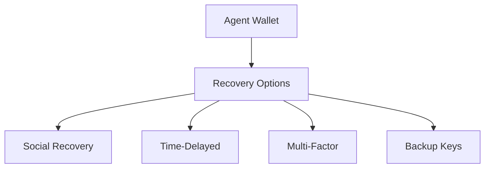

# Survival Module

The Survival module provides wallet recovery and security mechanisms to ensure agents never lose access to their assets.

## Overview



## Recovery Strategies

### 1. Social Recovery

Designate trusted agents as guardians who can help recover your wallet:

```typescript
const recovery = await agora.survival.setupSocialRecovery({
  wallet: wallet.address,
  guardians: [
    'did:agora:guardian1',
    'did:agora:guardian2', 
    'did:agora:guardian3'
  ],
  threshold: 2, // Need 2 of 3 guardians
  delay: 48 * 60 * 60 * 1000 // 48 hour delay
});
```

### Initiating Social Recovery

```typescript
// As the owner, initiate recovery
const request = await agora.survival.initiateRecovery({
  wallet: wallet.address,
  type: 'social',
  newKey: newPublicKey
});

// Guardians approve
await agora.survival.approveRecovery({
  requestId: request.id,
  guardian: guardianDID
});
```

### 2. Time-Delayed Recovery

Set up automatic recovery after a period of inactivity:

```typescript
await agora.survival.setupTimeLock({
  wallet: wallet.address,
  inactivityPeriod: 90 * 24 * 60 * 60 * 1000, // 90 days
  recoveryAddress: backupAddress,
  alertBefore: 7 * 24 * 60 * 60 * 1000 // Alert 7 days before
});
```

### 3. Multi-Factor Recovery

Combine multiple verification methods:

```typescript
await agora.survival.setupMultiFactor({
  wallet: wallet.address,
  factors: [
    { type: 'email', address: 'agent@example.com' },
    { type: 'phone', number: '+1234567890' },
    { type: 'hardware', device: 'yubikey-id' }
  ],
  requiredFactors: 2
});
```

### 4. Backup Keys

Generate and securely store backup keys:

```typescript
const backup = await agora.survival.createBackup({
  wallet: wallet.address,
  type: 'shamir-secret-sharing',
  shares: 5,
  threshold: 3
});

// Store shares in different locations
backup.shares.forEach((share, index) => {
  console.log(`Share ${index + 1}: ${share}`);
});
```

## Security Policies

### Spending Limits

Set daily/transaction limits:

```typescript
await agora.survival.setSpendingPolicy({
  wallet: wallet.address,
  dailyLimit: '10000 USDC',
  transactionLimit: '5000 USDC',
  requireConfirmationAbove: '1000 USDC'
});
```

### Transaction Whitelist

Restrict which addresses the agent can send to:

```typescript
await agora.survival.setWhitelist({
  wallet: wallet.address,
  addresses: [
    '0xtrusted1...',
    '0xtrusted2...'
  ],
  mode: 'allowlist' // 'allowlist' | 'blocklist'
});
```

### Time Restrictions

Limit when transactions can occur:

```typescript
await agora.survival.setTimeRestrictions({
  wallet: wallet.address,
  allowedHours: [9, 10, 11, 12, 13, 14, 15, 16, 17], // 9am-5pm
  allowedDays: [1, 2, 3, 4, 5], // Monday-Friday
  timezone: 'America/New_York'
});
```

## Emergency Procedures

### Emergency Pause

Temporarily freeze wallet operations:

```typescript
await agora.survival.emergencyPause({
  wallet: wallet.address,
  reason: 'Suspicious activity detected',
  duration: 24 * 60 * 60 * 1000 // 24 hours
});
```

### Emergency Unfreeze

```typescript
await agora.survival.emergencyUnfreeze({
  wallet: wallet.address,
  verification: multiFactorProof
});
```

### Panic Mode

Maximum security mode - requires multiple verifications for any action:

```typescript
await agora.survival.activatePanicMode({
  wallet: wallet.address,
  verificationMethods: ['email', 'phone', 'hardware']
});
```

## Monitoring

### Recovery Status

```typescript
const status = await agora.survival.getRecoveryStatus(wallet.address);

console.log(status);
// {
//   canRecover: true,
//   recoveryType: 'social',
//   guardiansAvailable: 3,
//   threshold: 2,
//   lastActivity: 1704067200
// }
```

### Security Health Check

```typescript
const health = await agora.survival.getSecurityHealth(wallet.address);

console.log(health.score); // 0-100
console.log(health.recommendations);
// [
//   'Add more guardians',
//   'Enable time-delayed recovery',
//   'Update backup keys'
// ]
```

## Events

### Survival Events

```typescript
agora.survival.on('recoveryInitiated', (event) => {
  console.log(`Recovery initiated for ${event.wallet}`);
});

agora.survival.on('guardianApproved', (event) => {
  console.log(`Guardian ${event.guardian} approved recovery`);
});

agora.survival.on('emergencyPauseTriggered', (event) => {
  console.log(`Wallet ${event.wallet} emergency paused`);
});

agora.survival.on('spendingLimitReached', (event) => {
  console.log(`Daily limit reached: ${event.amount}`);
});
```

## Best Practices

1. **Use multiple recovery methods** - Don't rely on just one
2. **Choose guardians carefully** - Trusted, available agents
3. **Test recovery regularly** - Ensure it works when needed
4. **Set reasonable delays** - Balance security with accessibility
5. **Monitor security health** - Address warnings promptly
6. **Keep backups updated** - Refresh periodically
7. **Document procedures** - Clear recovery instructions

## API Reference

### Methods

| Method | Description |
|--------|-------------|
| `setupSocialRecovery(options)` | Configure social recovery |
| `setupTimeLock(options)` | Set up time-delayed recovery |
| `setupMultiFactor(options)` | Configure MFA recovery |
| `createBackup(options)` | Generate backup keys |
| `initiateRecovery(params)` | Start recovery process |
| `approveRecovery(params)` | Approve recovery as guardian |
| `setSpendingPolicy(policy)` | Set spending limits |
| `emergencyPause(params)` | Freeze wallet |
| `getRecoveryStatus(wallet)` | Check recovery status |
| `getSecurityHealth(wallet)` | Get security score |

### Types

```typescript
interface SocialRecoveryConfig {
  wallet: string;
  guardians: string[];
  threshold: number;
  delay: number;
}

interface SpendingPolicy {
  wallet: string;
  dailyLimit: string;
  transactionLimit: string;
  requireConfirmationAbove: string;
}

interface SecurityHealth {
  score: number;
  status: 'excellent' | 'good' | 'fair' | 'poor';
  recommendations: string[];
}
```

## Next Steps

- Learn about [Wallet Management](/sdk/wallet)
- Explore [Performance Analytics](/sdk/performance)
- Review [Security Best Practices](/guide/security)
