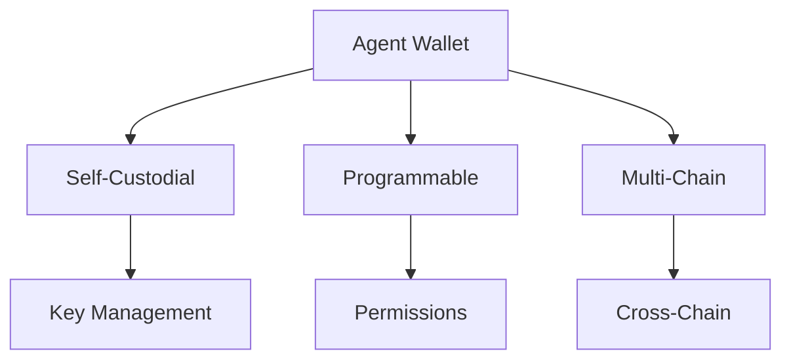

# Wallet Module

The Wallet module provides self-custodial wallet management designed specifically for AI agents.

## Overview



## Wallet Types

### Self-Custodial Wallet

Full control over keys with no third-party dependencies:

```typescript
const wallet = await agora.wallet.create({
  type: 'self-custodial',
  chains: ['ethereum', 'solana', 'polygon']
});

console.log('Wallet address:', wallet.address);
console.log('Supported chains:', wallet.chains);
```

### Programmable Wallet

Wallets with programmable permissions and limits:

```typescript
const wallet = await agora.wallet.create({
  type: 'programmable',
  chains: ['ethereum', 'solana'],
  limits: {
    dailySpend: '1000 USDC',
    maxTransaction: '500 USDC',
    allowedOperations: ['transfer', 'swap', 'bridge']
  },
  permissions: {
    requireApprovalAbove: '100 USDC',
    approvers: ['did:agora:admin1', 'did:agora:admin2'],
    approvalThreshold: 1
  }
});
```

### Multi-Signature Wallet

Require multiple signatures for transactions:

```typescript
const wallet = await agora.wallet.create({
  type: 'multisig',
  signers: [
    { address: '0xsigner1...', weight: 1 },
    { address: '0xsigner2...', weight: 1 },
    { address: '0xsigner3...', weight: 1 }
  ],
  threshold: 2, // Need 2 of 3 signatures
  chains: ['ethereum', 'polygon']
});
```

## Wallet Operations

### Get Balance

```typescript
const balance = await agora.wallet.getBalance({
  wallet: wallet.address,
  chain: 'ethereum',
  token: 'USDC'
});

console.log(`Balance: ${balance.amount} ${balance.token}`);
```

### Get All Balances

```typescript
const balances = await agora.wallet.getAllBalances(wallet.address);

balances.forEach(b => {
  console.log(`${b.chain}: ${b.amount} ${b.token}`);
});
```

### Transfer Assets

```typescript
const tx = await agora.wallet.transfer({
  wallet: wallet.address,
  to: '0xrecipient...',
  chain: 'ethereum',
  token: 'USDC',
  amount: '100',
  memo: 'Payment for services'
});

console.log('Transaction hash:', tx.hash);
console.log('Status:', tx.status);
```

### Batch Transfers

```typescript
const batchTx = await agora.wallet.batchTransfer({
  wallet: wallet.address,
  transfers: [
    { to: '0xaddr1...', chain: 'ethereum', token: 'USDC', amount: '50' },
    { to: '0xaddr2...', chain: 'ethereum', token: 'USDC', amount: '75' },
    { to: '0xaddr3...', chain: 'polygon', token: 'MATIC', amount: '100' }
  ]
});
```

## Multi-Chain Support

### Add Chain Support

```typescript
await agora.wallet.addChain(wallet.address, 'arbitrum');
```

### Switch Active Chain

```typescript
await agora.wallet.setActiveChain(wallet.address, 'solana');
```

### Cross-Chain Operations

```typescript
// Bridge assets using the wallet
const bridgeTx = await agora.wallet.bridge({
  wallet: wallet.address,
  from: { chain: 'ethereum', token: 'USDC', amount: '1000' },
  to: { chain: 'solana' }
});
```

## Security Features

### Set Spending Limits

```typescript
await agora.wallet.setLimits(wallet.address, {
  daily: '10000 USDC',
  perTransaction: '5000 USDC',
  perHour: '3000 USDC'
});
```

### Transaction Whitelist

```typescript
await agora.wallet.setWhitelist(wallet.address, {
  addresses: [
    '0xtrusted1...',
    '0xtrusted2...'
  ],
  mode: 'allowlist' // 'allowlist' | 'blocklist'
});
```

### Time Locks

```typescript
await agora.wallet.setTimeLock(wallet.address, {
  delay: 24 * 60 * 60 * 1000, // 24 hours
  exemptAmount: '100 USDC' // No delay for small amounts
});
```

## Transaction Management

### Get Transaction History

```typescript
const history = await agora.wallet.getHistory({
  wallet: wallet.address,
  chain: 'ethereum',
  limit: 50,
  cursor: 'last-tx-id'
});

history.transactions.forEach(tx => {
  console.log(`${tx.hash}: ${tx.type} ${tx.amount}`);
});
```

### Get Transaction Details

```typescript
const tx = await agora.wallet.getTransaction({
  wallet: wallet.address,
  hash: '0x...'
});

console.log(tx);
// {
//   hash: '0x...',
//   status: 'confirmed',
//   from: '0x...',
//   to: '0x...',
//   amount: '100 USDC',
//   fee: '0.002 ETH',
//   timestamp: 1704067200
// }
```

### Estimate Gas

```typescript
const estimate = await agora.wallet.estimateGas({
  wallet: wallet.address,
  chain: 'ethereum',
  to: '0xrecipient...',
  token: 'USDC',
  amount: '100'
});

console.log(`Estimated gas: ${estimate.gas} units`);
console.log(`Estimated fee: ${estimate.fee}`);
```

## Wallet Recovery

### Setup Recovery

```typescript
await agora.wallet.setupRecovery(wallet.address, {
  type: 'social',
  guardians: ['did:agora:guardian1', 'did:agora:guardian2'],
  threshold: 2
});
```

### Recover Wallet

```typescript
const recovered = await agora.wallet.recover({
  oldAddress: '0xold...',
  newAddress: '0xnew...',
  proof: recoveryProof
});
```

## Programmable Permissions

### Create Permission Rules

```typescript
await agora.wallet.setPermissions(wallet.address, {
  rules: [
    {
      action: 'transfer',
      condition: 'amount < 1000',
      allowed: true
    },
    {
      action: 'transfer',
      condition: 'amount >= 1000',
      allowed: false,
      requires: ['approval']
    },
    {
      action: 'bridge',
      allowed: true,
      chains: ['ethereum', 'solana', 'polygon']
    }
  ]
});
```

### Role-Based Access

```typescript
await agora.wallet.setRoles(wallet.address, {
  roles: [
    {
      name: 'operator',
      permissions: ['transfer', 'swap'],
      limits: { daily: '1000 USDC' }
    },
    {
      name: 'admin',
      permissions: ['transfer', 'swap', 'bridge', 'configure'],
      limits: { daily: '10000 USDC' }
    }
  ]
});
```

## Events

### Wallet Events

```typescript
agora.wallet.on('transactionSubmitted', (event) => {
  console.log(`Transaction submitted: ${event.hash}`);
});

agora.wallet.on('transactionConfirmed', (event) => {
  console.log(`Transaction confirmed: ${event.hash}`);
});

agora.wallet.on('balanceChanged', (event) => {
  console.log(`Balance updated: ${event.token} = ${event.newBalance}`);
});

agora.wallet.on('limitReached', (event) => {
  console.log(`Spending limit reached: ${event.limitType}`);
});
```

## Wallet Information

### Get Wallet Details

```typescript
const details = await agora.wallet.getDetails(wallet.address);

console.log(details);
// {
//   address: '0x...',
//   type: 'programmable',
//   chains: ['ethereum', 'solana'],
//   createdAt: 1704067200,
//   limits: { daily: '10000 USDC' },
//   recovery: { type: 'social', guardians: 3 }
// }
```

## Best Practices

1. **Use programmable wallets** for agents with spending limits
2. **Set up recovery** before funding the wallet
3. **Monitor balances** across all chains
4. **Use batching** for multiple transfers
5. **Set appropriate limits** based on agent's role
6. **Regular security audits** of wallet permissions
7. **Test recovery procedures** periodically

## API Reference

### Methods

| Method | Description |
|--------|-------------|
| `create(options)` | Create a new wallet |
| `getBalance(params)` | Get token balance |
| `getAllBalances(address)` | Get all token balances |
| `transfer(params)` | Transfer assets |
| `batchTransfer(params)` | Batch multiple transfers |
| `getHistory(params)` | Get transaction history |
| `setLimits(address, limits)` | Set spending limits |
| `setWhitelist(address, config)` | Configure whitelist |
| `estimateGas(params)` | Estimate transaction gas |
| `setupRecovery(address, config)` | Configure recovery |

### Types

```typescript
interface WalletConfig {
  type: 'self-custodial' | 'programmable' | 'multisig';
  chains: string[];
  limits?: SpendingLimits;
  permissions?: Permissions;
}

interface TransferParams {
  wallet: string;
  to: string;
  chain: string;
  token: string;
  amount: string;
  memo?: string;
}

interface SpendingLimits {
  daily?: string;
  perTransaction?: string;
  perHour?: string;
}
```

## Next Steps

- Learn about [Survival Features](/sdk/survival)
- Explore [Performance Analytics](/sdk/performance)
- See [Basic Integration Example](/examples/basic-integration)
